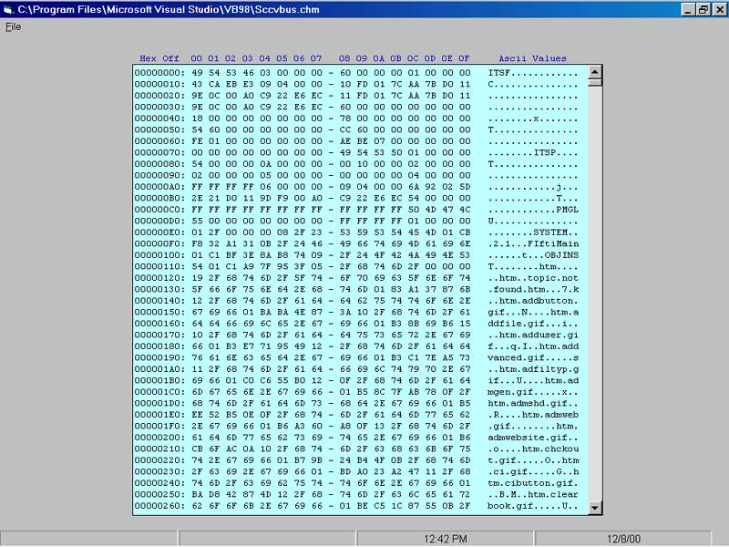



## HexViewer

### Description

Display the contents of any file in Hex/Ascii format. Code is well-documented and demonstrates uses of the Status Bar, Progress Bar & Rich Text Box controls.

Updated program on 12/13/2000: Added a C Dll that greatly increased format speed of input file.

Check HexView.cpp for a tip on how to debug a dll called from Visual Basic.

I included Visual Basic statements in the HexView.cpp file so it serves as a tutorial for someone interested in writing a C Dll.
 
### More Info
 
From the Projects|Components Menu...The Following Following Components must be included in the Project:

Microsoft Common Dialog Control 6.0

Microsoft Rich TextBox Control 6.0

Microsoft Windows Common Controls 6.0

Calls HexView.dll for performance enhancement

             |
---                |---
**Submitted On**   |2000-12-13 08:55:48
**By**             |[Gary Schumacher](https://github.com/Planet-Source-Code/PSCIndex/blob/master/ByAuthor/gary-schumacher.md)
**Level**          |Advanced
**User Rating**    |5.0 (15 globes from 3 users)
**Compatibility**  |VB 6\.0
**Category**       |[Miscellaneous](https://github.com/Planet-Source-Code/PSCIndex/blob/master/ByCategory/miscellaneous__1-1.md)
**World**          |[Visual Basic](https://github.com/Planet-Source-Code/PSCIndex/blob/master/ByWorld/visual-basic.md)
**Archive File**   |[CODE\_UPLOAD1263912132000\.zip](https://github.com/Planet-Source-Code/gary-schumacher-hexviewer__1-13432/archive/master.zip)

### API Declarations

Custom HexView.dll

